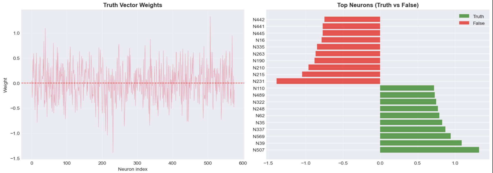

# TWhite-Box Alignment

## Project Stages

1. Synthetic Data Generation and Augmentation
A synthetic dataset with strict (True / False) labels was created to train the lie detector and ensure a clean signal.

2. Latent State Localization (Linear Probing) A critical phase involved identifying the model's internal state correlated with factual truth. Feature Collection: Hidden states (activations) of the model were collected at the final prompt token.Classifier Training: A Linear Probe (Logistic Regression) was trained on the collected activations, successfully identifying the hyperplane separating "True" and "False" states with high accuracy.Result: The resulting weight vector from the probe was mathematically defined as the Truth Vector.

3. Model Behavior Control (Activation Steering) This demonstrated the capacity to alter model behavior without computationally expensive retraining. Intervention Principle: During generation, a vector shift — determined by the Truth Vector and the coefficient (intervention strength) — was added to the activations of a selected model layer. Testing demonstrated a direct influence of on factual output: positive values steered generation toward truth, while negative values forced false or hallucinatory statements.

Models: smollm-125m
